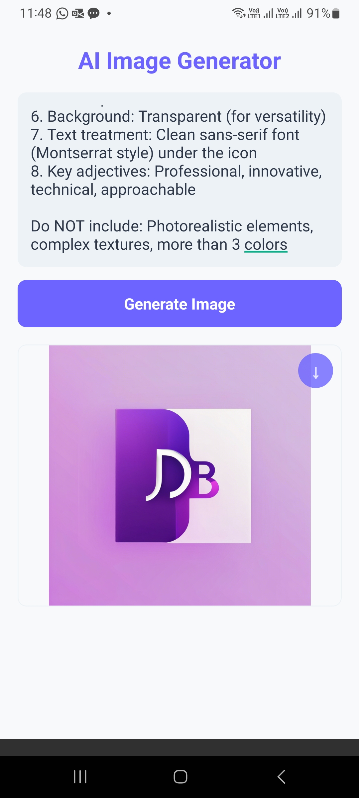

# React Native AI Components

Collection of ready-to-use AI components for React Native apps.

## Features

1. **AI Response Generator**  
      
   - OpenAI/GROQ API integration  
   - Chat history with timestamps  
   - Simple copy-paste implementation  


2. **AI Image Generator**
      
    - Stability AI/Replicate API integration
    - One-tap image saving to gallery
    - Customizable prompt templates

## Quick Start

```
git clone https://github.com/yourusername/react-native-ai-components
cd react-native-ai-components
npm install
```
